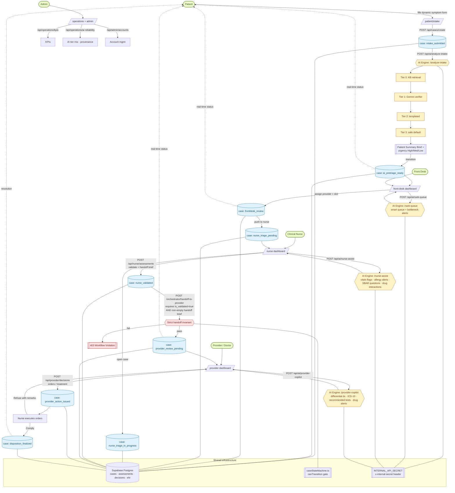
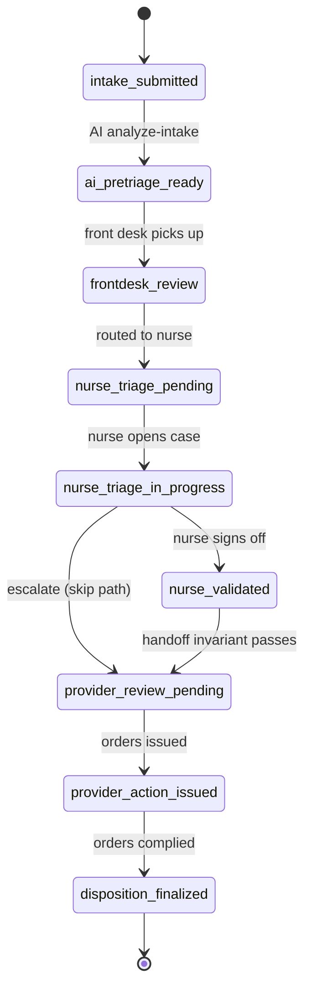
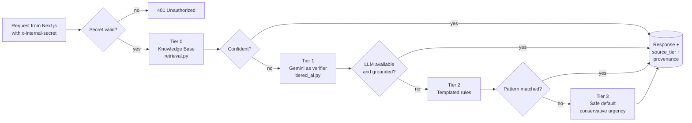

# FrudgeCare AI — System Flow

This document is the canonical, code-grounded picture of how FrudgeCare AI works end-to-end. It is derived from:

- `apps/web/src/lib/caseStateMachine.ts` — the 9-state case finite-state machine.
- `services/ai-engine/main.py` and `services/ai-engine/tiered_ai.py` — the FastAPI AI engine and its tiered fallback.
- `apps/web/src/app/api/**` — the Next.js API routes that broker every action.
- `documents/product/working flow and vision of the system.txt` — the product vision and the "Action Loop".

If the code and this document disagree, the code wins — please update this file in the same PR.

---

## 1. End-to-end system flowchart

Roles, the case state machine, the AI engine, and the shared infrastructure in one view.

---

## 2. Case state machine

The canonical happy path enforced by `canTransition()` in `apps/web/src/lib/caseStateMachine.ts` and re-validated server-side by `POST /api/cases/transition`. A bug in any UI page can never write an impossible state because the API rejects it.

| Status                     | Label              | Owner       |
| -------------------------- | ------------------ | ----------- |
| `intake_submitted`         | Submitted          | Patient     |
| `ai_pretriage_ready`       | AI Triage Ready    | AI Engine   |
| `frontdesk_review`         | Front Desk Review  | Front Desk  |
| `nurse_triage_pending`     | Awaiting Nurse     | Front Desk  |
| `nurse_triage_in_progress` | Nurse In Progress  | Nurse       |
| `nurse_validated`          | Nurse Validated    | Nurse       |
| `provider_review_pending`  | Awaiting Provider  | Provider    |
| `provider_action_issued`   | Decision Issued    | Provider    |
| `disposition_finalized`    | Closed             | Nurse / AI  |

---

## 3. AI tiered-resilience flow

Every AI endpoint (`/analyze-intake`, `/ai/rank-queue`, `/ai/nurse-assist`, `/ai/provider-copilot`) follows the same 4-tier degradation. The system never hard-fails — if Gemini is unavailable, KB retrieval, templated rules, and a safe-default tier still produce a structured, audit-friendly response.

Every response carries `source_tier` (0–3) and `provenance[]`, which the Operations dashboard reads via `/api/operations/ai-reliability` to monitor tier mix over time.

---

## 4. Endpoint map

### Next.js API routes (`apps/web/src/app/api`)

| Route                              | Purpose                                                          |
| ---------------------------------- | ---------------------------------------------------------------- |
| `POST /api/cases/create`           | Create a case from the patient intake form.                      |
| `POST /api/cases/transition`       | Move a case between statuses; rejects illegal transitions.       |
| `POST /api/nurse/assessments`      | Persist nurse assessment + validated handoff brief.              |
| `POST /api/provider/decisions`     | Persist provider orders / treatment steps.                       |
| `POST /api/ai/analyze-intake`      | Proxy to AI engine `/analyze-intake`.                            |
| `POST /api/ai/rank-queue`          | Proxy to AI engine `/ai/rank-queue`.                             |
| `POST /api/ai/nurse-assist`        | Proxy to AI engine `/ai/nurse-assist`.                           |
| `POST /api/ai/provider-copilot`    | Proxy to AI engine `/ai/provider-copilot`.                       |
| `GET  /api/operations/kpis`        | Operational KPIs for the operations dashboard.                   |
| `GET  /api/operations/ai-reliability` | Tier-mix and provenance telemetry for AI calls.               |
| `*    /api/admin/accounts`         | Admin account management.                                        |

All AI proxies attach `x-internal-secret: $INTERNAL_API_SECRET` before calling the FastAPI engine.

### AI engine (`services/ai-engine/main.py`)

| Route                                      | Purpose                                                              |
| ------------------------------------------ | -------------------------------------------------------------------- |
| `POST /analyze-intake`                     | Pre-triage: urgency, summary, risks, clinician brief.                |
| `POST /ai/rank-queue`                      | Front-desk smart queue + bottleneck alerts.                          |
| `POST /ai/nurse-assist`                    | Vitals flags, allergy alerts, SBAR questions, drug interactions.     |
| `POST /ai/provider-copilot`                | Differential dx + ICD-10, recommended tests, drug-interaction alerts. |
| `POST /orchestrator/handoff-to-provider`   | Enforces nurse-validation invariant before provider review.          |
| `POST /orchestrator/submit-provider-action`| Enforces "must read a valid nurse assessment" before issuing orders. |
| `GET  /health`                             | Liveness + LLM availability.                                         |

---

## 5. Hard invariants (don't break these)

1. **No status skipping.** `caseStateMachine.canTransition(from, to)` is the only legal transition oracle, and `/api/cases/transition` re-validates it server-side.
2. **Nurse-before-provider.** `/orchestrator/handoff-to-provider` returns `403 Workflow Violation` unless `is_validated === true` **and** `provider_handoff_brief` is non-empty.
3. **No orders without a read assessment.** `/orchestrator/submit-provider-action` returns `403` unless `active_nurse_assessment_id` is present.
4. **Internal-only AI engine.** Every AI route requires `x-internal-secret`; the browser never calls the FastAPI engine directly — only the Next.js API routes do.
5. **Graceful AI degradation.** If `GEMINI_API_KEY` is missing or Gemini errors out, the engine logs and continues in KB-only mode (Tier 0/2/3); it never raises a 5xx for an LLM outage.
6. **Provenance is mandatory.** Every AI response sets `source_tier` and `provenance[]` so Operations can audit which tier produced a decision.

---

## 6. Roles & responsibilities

- **Patient** — source of truth for symptoms; consumer of real-time case status.
- **Front Desk** — traffic management, AI-ranked queue, slot assignment.
- **Clinical Nurse** — primary coordinator, gatekeeper of clinical data, validates AI output before any provider sees it.
- **Provider / Doctor** — final clinical authority; issues orders / treatment using the co-pilot.
- **Admin** — account management, system configuration, operations dashboards.
- **AI (Orchestrator)** — background engine that pre-triages, ranks, assists, and proposes — but never auto-decides.
